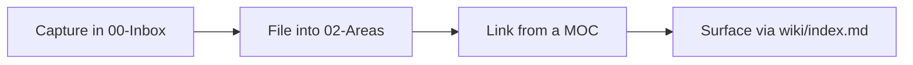

# Example Topic

This note shows the conventions every knowledge note should follow: rich frontmatter
(so Obsidian Bases can query it), wikilinks, callouts, and an optional diagram.

> [!info] Why frontmatter matters
> `domain`, `status`, and `related` turn a flat note into queryable data and a graph node.

## Idea
Write atomic, self-contained notes. Link generously with [[wikilinks]] — connections are
the point of a second brain.

## A diagram (renders natively in Obsidian)

## Related
- [[Example-Domain]]
