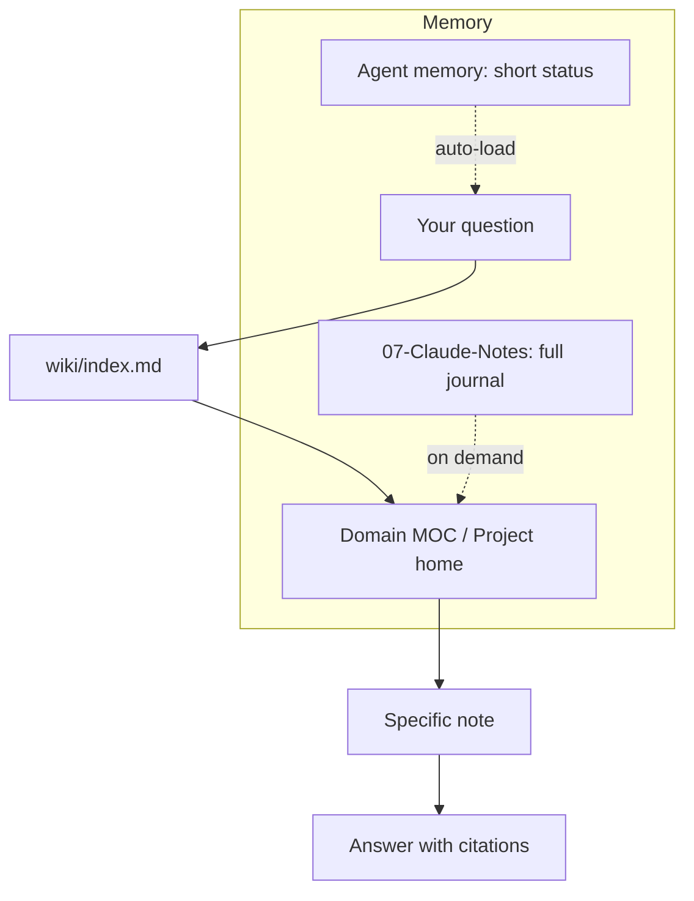

# debby-claudia

**A Claude × Obsidian "second brain" architecture — hybrid-light edition.**

Turn an Obsidian vault into a knowledge base your AI actually reads efficiently:
token-savvy tiered reading, PARA folders + one thin wiki index, a prompt protocol that
scales with task size, and memory that survives across sessions. Use it with **Claude Code**
(or any skills-compatible agent).

> Designed to be **lightweight on purpose**. Most "AI second brain" setups bolt on heavy
> retrieval engines, locks, and indexers. This one keeps the 80% of value (cross-session
> memory, citations, token discipline) without the 80% of overhead.

---

## Why this exists

An LLM working in a 800-note vault has two failure modes: it re-reads everything (burning
tokens) or it answers from training data (no citations, no memory). This architecture fixes
both with three habits encoded in `CLAUDE.md`:

1. **Tiered reading** — always go `wiki/index.md` → domain MOC → specific note. Stop as shallow
   as the question allows. Never scan the whole vault.
2. **Weight-scaled prompting** — light tasks get answered directly; substantial tasks trigger a
   short alignment ritual (read context → state key rules → plan → confirm → execute).
3. **Two-layer memory** — a short status in the agent's memory (auto-loaded each session) plus a
   full human-readable journal in `07-Claude-Notes/`.

---

## Install

### Option A — Claude Code plugin
```
/plugin marketplace add solapentula/debby-claudia
/plugin install debby-claudia@debby-claudia
```
Then, inside any Obsidian vault opened with Claude Code:
```
/secondbrain-init
```
Claude surveys your vault, asks what it's for, and scaffolds the structure (never overwriting
your notes).

### Option B — Clone as a vault template
```
git clone https://github.com/solapentula/debby-claudia
```
Open the folder in Obsidian (**Manage Vaults → Open folder as vault**) and open Claude Code in
the same folder. Edit `CLAUDE.md`, fill in the `{{placeholders}}`, and start adding notes.

### Optional — Obsidian authoring skills
```
bash bin/setup.sh
```
Installs [kepano/obsidian-skills](https://github.com/kepano/obsidian-skills) (`obsidian-markdown`,
`obsidian-bases`, `json-canvas`, `obsidian-cli`, `defuddle`) into `.claude/skills/` so Claude
writes correct Obsidian Markdown and saves tokens on web clips.

---

## What's inside

```
debby-claudia/
├── CLAUDE.md              # the contract — auto-loaded every session (lean, fill the {{blanks}})
├── default-prompt.md      # full alignment ritual for substantial tasks
├── wiki/
│   └── index.md           # master "map of maps" — entry point for tiered reading
├── 00-Inbox/              # capture first, file later
├── 01-Projects/           # active, time-bound work        (example included)
├── 02-Areas/              # ongoing responsibilities / knowledge (example MOC + note)
├── 03-Resources/          # reference material
├── 04-Archives/           # inactive
├── 05-Daily-Notes/
├── 06-Templates/          # Daily, Weekly, Project, Literature, Claude Session
├── 07-Claude-Notes/       # cross-session journal (the "full" memory layer)
├── commands/secondbrain-init.md   # /secondbrain-init bootstrap
├── hooks/hooks.json       # light SessionStart hook → surfaces wiki/index.md
├── docs/ARCHITECTURE.md   # the design, in depth (with diagrams)
└── bin/setup.sh           # optional: install kepano skills
```

Folders use **PARA** (Projects / Areas / Resources / Archives). The one addition is
`wiki/index.md`: a single hand-maintained map that points to project homes and domain MOCs, so
the agent has a cheap, reliable entry point instead of guessing.

---

## The three habits in one picture



See [`docs/ARCHITECTURE.md`](docs/ARCHITECTURE.md) for the full rationale.

---

## Make it yours
- Edit `CLAUDE.md`: owner, language(s), active projects, and any domain skills you add.
- Keep `CLAUDE.md` short — it's loaded every session, so every line costs tokens.
- Maintain `wiki/index.md` by hand (or have Claude update it). It's the cheapest, highest-leverage
  file in the vault.
- Put real reference sources you don't want public in `.sources/` — it's gitignored by default.

---

## Credits & inspiration
- [PARA method](https://fortelabs.com/blog/para/) by Tiago Forte — the folder model.
- [kepano/obsidian-skills](https://github.com/kepano/obsidian-skills) — Obsidian authoring skills (MIT).
- [AgriciDaniel/claude-obsidian](https://github.com/AgriciDaniel/claude-obsidian) — the full "running
  notetaker" wiki engine that inspired the tiered-read + hot-cache idea (MIT).
- [Andrej Karpathy's LLM Wiki pattern](https://gist.github.com/karpathy/442a6bf555914893e9891c11519de94f).
- Timo Laitila, ["Using Claude Code for organizing your second brain"](https://trailway.medium.com/using-claude-code-for-organizing-your-second-brain-39137af6f596).

## License
MIT © 2026 solapentula. See [LICENSE](LICENSE).
