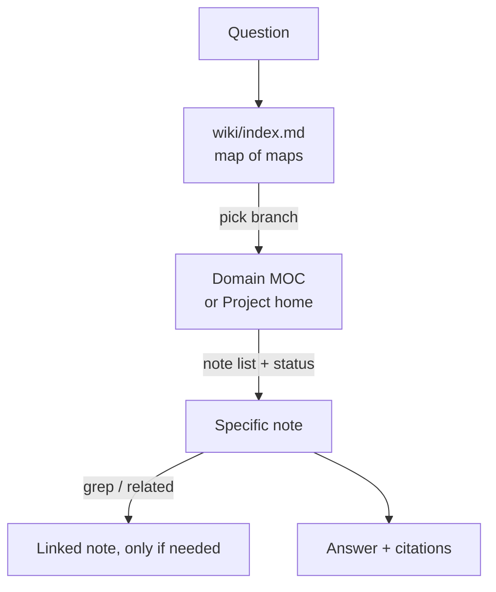
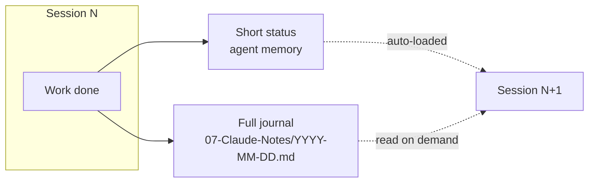

# Architecture

`debby-claudia` is a **hybrid-light** second-brain pattern for Claude × Obsidian. This document
explains the design decisions so you can adapt — or deliberately deviate from — them.

## Design goals
1. **Token efficiency** — the agent should read as little as possible to answer well.
2. **Cross-session continuity** — no re-explaining context every time.
3. **Citations over recall** — answers come from your notes, not the model's memory.
4. **Low maintenance** — no daemons, indexers, or locks to babysit.

## The spectrum: heavy vs. light
Full "AI wiki" engines (e.g. AgriciDaniel/claude-obsidian + DragonScale) ingest every source into
atomic pages, maintain a hot cache, run BM25/rerank retrieval, deterministic addressing, file
locks, and auto-commit hooks. Powerful for large research corpora — but heavy, and expensive on
every ingest.

This template keeps the parts with the best value-to-cost ratio and drops the rest:

| Feature | Heavy engine | debby-claudia |
|---|---|---|
| Atomic pages + cross-links | yes | yes (your normal notes) |
| Tiered read entry point | `index.md` + sub-indexes | `wiki/index.md` (one map) |
| Cross-session memory | `hot.md` cache + hooks | agent memory + `07-Claude-Notes` journal |
| Retrieval | BM25 + rerank scripts | `grep` + frontmatter `related` |
| Page addressing / locks | deterministic + lockfiles | none (plain files) |
| Auto-commit hooks | yes | optional / your choice |

You can graduate to the heavy engine later; nothing here blocks that.

## The three mechanisms

### 1. Tiered reading
The agent never scans the vault. It descends a fixed path and stops early:

`wiki/index.md` is the keystone: a small, hand-maintained file listing project homes and domain
MOCs. Because it's tiny and always read first, it gives the agent a reliable, cheap orientation.

### 2. Weight-scaled prompt protocol
Not every prompt deserves a ritual. `CLAUDE.md` tells the agent to judge task weight:

- **Light** (a question, a lookup, a small edit) → answer directly.
- **Substantial** (a deliverable, multi-step work, attached context) → run the alignment ritual in
  `default-prompt.md`: read context in full → state the 3 most important rules → ask clarifying
  questions → propose a ≤5-step plan → execute only after agreement.

This keeps quick questions fast while keeping big work safe.

### 3. Two-layer cross-session memory

The short status is what the agent loads automatically to resume. The journal is the durable,
human-readable record you can browse and edit in Obsidian.

## Folder model (PARA)
- **00-Inbox** — capture point; nothing stays here long.
- **01-Projects** — active, time-bound efforts (have an end state).
- **02-Areas** — ongoing responsibilities and standing knowledge; this is where domain MOCs live.
- **03-Resources** — reference material.
- **04-Archives** — inactive items.
- **05-Daily-Notes / 06-Templates / 07-Claude-Notes** — operational support.

## Conventions that make it queryable
- YAML frontmatter on every note (`date`, `tags`, `source`; plus `domain`/`status`/`related` for
  knowledge notes). With these fields, Obsidian **Bases** can build live tables, and the agent can
  `grep` precisely instead of reading files in full.
- Wikilinks everywhere; consistent tags (avoid one-off tags that fragment the graph).
- Hybrid dates: display `DD-MMM-YY`, machine `YYYY-MM-DD`.

## Privacy
This is a public template. Keep private or copyrighted material out of git:
`.sources/` and `.claude/settings.local.json` are gitignored by default. Never commit API tokens.

## Extending
- Add domain skills (e.g. a `/literature` command) and document them in `CLAUDE.md` → "Skills".
- Add domain MOCs under `02-Areas/<Domain>/<Domain>.md` and link them from `wiki/index.md`.
- If your vault grows past a few thousand notes and `grep` stops being enough, consider the heavy
  engine's retrieval layer.
